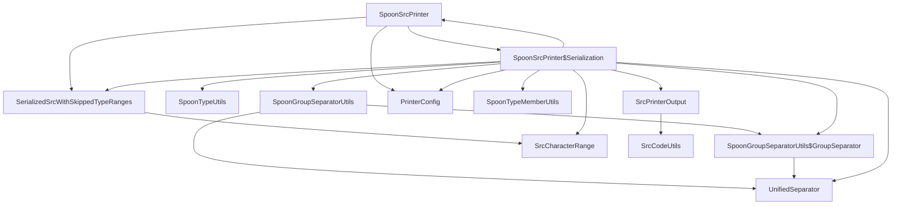

<!--
SPDX-FileCopyrightText: 2026 Anton Lem <antonlem78@gmail.com>
SPDX-License-Identifier: Apache-2.0
-->

# Printer dependency graph

Declared bytecode dependencies within the measured scope.

```mermaid
graph TD
  io_github_lemon_ant_jharmonizer_core_config_unified_UnifiedSeparator["UnifiedSeparator"]
  io_github_lemon_ant_jharmonizer_core_spoon_SpoonGroupSeparatorUtils["SpoonGroupSeparatorUtils"]
  io_github_lemon_ant_jharmonizer_core_spoon_SpoonGroupSeparatorUtils_GroupSeparator["SpoonGroupSeparatorUtils$GroupSeparator"]
  io_github_lemon_ant_jharmonizer_core_spoon_SpoonTypeUtils["SpoonTypeUtils"]
  io_github_lemon_ant_jharmonizer_core_translator_SerializedSrcWithSkippedTypeRanges["SerializedSrcWithSkippedTypeRanges"]
  io_github_lemon_ant_jharmonizer_core_translator_SrcCharacterRange["SrcCharacterRange"]
  io_github_lemon_ant_jharmonizer_core_translator_spoon_PrinterConfig["PrinterConfig"]
  io_github_lemon_ant_jharmonizer_core_translator_spoon_SpoonSrcPrinter["SpoonSrcPrinter"]
  io_github_lemon_ant_jharmonizer_core_translator_spoon_SpoonSrcPrinter_Serialization["SpoonSrcPrinter$Serialization"]
  io_github_lemon_ant_jharmonizer_core_translator_spoon_SpoonTypeMemberUtils["SpoonTypeMemberUtils"]
  io_github_lemon_ant_jharmonizer_core_translator_spoon_SrcPrinterOutput["SrcPrinterOutput"]
  io_github_lemon_ant_jharmonizer_core_utilities_SrcCodeUtils["SrcCodeUtils"]
  io_github_lemon_ant_jharmonizer_core_spoon_SpoonGroupSeparatorUtils --> io_github_lemon_ant_jharmonizer_core_config_unified_UnifiedSeparator
  io_github_lemon_ant_jharmonizer_core_spoon_SpoonGroupSeparatorUtils --> io_github_lemon_ant_jharmonizer_core_spoon_SpoonGroupSeparatorUtils_GroupSeparator
  io_github_lemon_ant_jharmonizer_core_spoon_SpoonGroupSeparatorUtils_GroupSeparator --> io_github_lemon_ant_jharmonizer_core_config_unified_UnifiedSeparator
  io_github_lemon_ant_jharmonizer_core_translator_SerializedSrcWithSkippedTypeRanges --> io_github_lemon_ant_jharmonizer_core_translator_SrcCharacterRange
  io_github_lemon_ant_jharmonizer_core_translator_spoon_SpoonSrcPrinter --> io_github_lemon_ant_jharmonizer_core_translator_SerializedSrcWithSkippedTypeRanges
  io_github_lemon_ant_jharmonizer_core_translator_spoon_SpoonSrcPrinter --> io_github_lemon_ant_jharmonizer_core_translator_spoon_PrinterConfig
  io_github_lemon_ant_jharmonizer_core_translator_spoon_SpoonSrcPrinter --> io_github_lemon_ant_jharmonizer_core_translator_spoon_SpoonSrcPrinter_Serialization
  io_github_lemon_ant_jharmonizer_core_translator_spoon_SpoonSrcPrinter_Serialization --> io_github_lemon_ant_jharmonizer_core_config_unified_UnifiedSeparator
  io_github_lemon_ant_jharmonizer_core_translator_spoon_SpoonSrcPrinter_Serialization --> io_github_lemon_ant_jharmonizer_core_spoon_SpoonGroupSeparatorUtils
  io_github_lemon_ant_jharmonizer_core_translator_spoon_SpoonSrcPrinter_Serialization --> io_github_lemon_ant_jharmonizer_core_spoon_SpoonGroupSeparatorUtils_GroupSeparator
  io_github_lemon_ant_jharmonizer_core_translator_spoon_SpoonSrcPrinter_Serialization --> io_github_lemon_ant_jharmonizer_core_spoon_SpoonTypeUtils
  io_github_lemon_ant_jharmonizer_core_translator_spoon_SpoonSrcPrinter_Serialization --> io_github_lemon_ant_jharmonizer_core_translator_SerializedSrcWithSkippedTypeRanges
  io_github_lemon_ant_jharmonizer_core_translator_spoon_SpoonSrcPrinter_Serialization --> io_github_lemon_ant_jharmonizer_core_translator_SrcCharacterRange
  io_github_lemon_ant_jharmonizer_core_translator_spoon_SpoonSrcPrinter_Serialization --> io_github_lemon_ant_jharmonizer_core_translator_spoon_PrinterConfig
  io_github_lemon_ant_jharmonizer_core_translator_spoon_SpoonSrcPrinter_Serialization --> io_github_lemon_ant_jharmonizer_core_translator_spoon_SpoonSrcPrinter
  io_github_lemon_ant_jharmonizer_core_translator_spoon_SpoonSrcPrinter_Serialization --> io_github_lemon_ant_jharmonizer_core_translator_spoon_SpoonTypeMemberUtils
  io_github_lemon_ant_jharmonizer_core_translator_spoon_SpoonSrcPrinter_Serialization --> io_github_lemon_ant_jharmonizer_core_translator_spoon_SrcPrinterOutput
  io_github_lemon_ant_jharmonizer_core_translator_spoon_SrcPrinterOutput --> io_github_lemon_ant_jharmonizer_core_utilities_SrcCodeUtils
```
