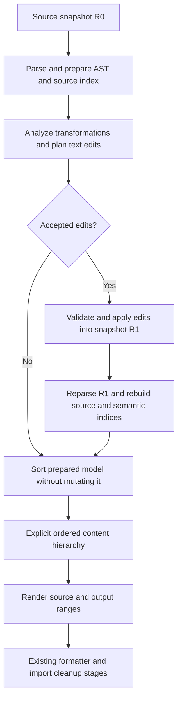

<!--
SPDX-FileCopyrightText: 2026 Anton Lem <antonlem78@gmail.com>
SPDX-License-Identifier: Apache-2.0
-->

# Explicit sorting results and future source rewrites

## Status and decision

Deferred design, reviewed on 2026-09-21 against the working tree using Spoon 11.5.0. This document records analysis;
the proposed pipeline and types are not implemented. Track implementation in
[the backlog](TODO.md#10-explicit-sorting-result-and-support-for-future-source-rewrites).

The direction is to return one explicit ordering model instead of combining a mutated Spoon compilation unit with
separately returned annotation groups. Extend this direction to support code transformations before sorting.
The first migration should preserve current output and sorting algorithms. Semantic rewrites are a separate step.

For the first rewrite features, prefer AST-guided text edits followed by reparsing before sorting. This gives sorting
and printing the same committed source revision without maintaining two independently editable representations.
Retain the possibility of incremental synchronization later, if measurements justify its additional contracts.

## Original proposal and current evidence

The original idea was to prepare a richer sorter input and return an immutable hierarchy of sorted types, members,
and attached annotation fragments that the custom printer can consume directly. It addresses an inconsistent contract:

| Current component | Observable behavior |
| --- | --- |
| `SpoonSorter.sortCompilationUnitRecursively` | Mutates top-level types and nested member lists; returns annotation groups. |
| `SpoonAnnotationSorter` | Orders lexical annotation groups; leaves AST annotation lists unchanged. |
| `GroupBoundaryMarker` | Stores separator instructions in metadata on the first member of each group. |
| `Sorter.sort` | Uses `withAnnotationSrcGroups`; the input and result wrappers retain the same mutable compilation unit. |
| `SpoonSrcPrinter` | Reads current Spoon members, positions, annotation presence, and separator metadata while copying source. |
| `RelocationDetector` | Compares original node identities with the mutated AST traversal and detects annotation permutations from lexer source offsets. |

Consequently, sorting the same input model with configuration A and then B can leave result A holding annotation
order A alongside the member order and metadata produced by B. Immutable outer lists do not isolate this shared state.
This is an architectural consequence of the inspected references, not a new runtime reproducer executed for this note.

Spoon does retain annotation lists. The extra source representation exists to retain exact spelling, comments,
parentheses, and constructs absent from the model. It is inaccurate to say that the compilation unit cannot contain
annotations at all. Conversely, its annotation lists cannot replace all existing lexical fragments.
Only lexical groups carry the output annotation order; sorting AST annotation lists would duplicate unused work.

`MemberGroupBlock` is a useful starting point: the sorter already computes ordered groups, then marks boundaries and
flattens the groups back into Spoon lists. Preserve that useful result instead of reconstructing it during printing.
Keep the existing grouping, accessor clustering, comparators, and dependency-aware ordering algorithms.

The printer is already project-owned and does not inherit from a Spoon printer. Accepting a project-specific result
requires no compatibility with a Spoon pretty-printer input API. Current behavior is documented in
[the sorter overview](04-Sorter.md) and [the printer overview](source-printer.md).

## Proposed boundaries and data

Use Spoon to understand Java declarations, select groups, and compute dependencies. Use an explicit result to express
the chosen order, source content, nesting, and separator requests. Keep output whitespace, indentation, line endings,
and output-range calculation in the rendering stage. This requires neither another full Java AST nor a formatter
inside the sorter.

The following names describe responsibilities, not committed Java classes:

| Concept | Required state and purpose |
| --- | --- |
| Source snapshot | Exact immutable text, input identity, and revision identity; the coordinate system for slices. |
| Prepared source model | Matching Spoon AST, lexical annotation groups, source ownership, opt-outs, and declaration identities. |
| Source slice | Snapshot reference and a validated half-open UTF-16 range; no eager substring copy is necessary. |
| Generated text | Explicit inserted/replacement content, with the transformation or layout operation that produced it. |
| Composite content | Ordered slices, generated content, and nested content; represents modified or rearranged fragments. |
| Ordered scope/group | Ordered members, nested scopes, and separator requests that previously lived in metadata. |
| Sorting result | One complete ordered hierarchy, source provenance, diagnostic facts, and statistics. |

The existing facade already accepts `SpoonAstModel`; a new input wrapper is useful only if it establishes the stronger
contract that AST, fragments, and indices belong to one source revision. Adding a wrapper solely to hide three method
arguments would not solve the underlying issue. Prepare source relationships once before sorting, rather than adding
another printer-only scan of the same relationships.

Optional `CtTypeMember` references are an acceptable migration compromise. Document such a result as having immutable
order and content, with mutable external references. Snapshot the positions, names, kinds, spacing facts, and other
values actually needed by printing and stable diagnostics; those consumers must not recover them later from mutable
nodes. Deep-copying the entire Spoon graph is not a prerequisite. Retaining references also retains their reachable
AST and has a memory cost; omit them from the final rendering structure when no consumer needs them.

After sorting, source slices and saved layout facts can be sufficient for rendering. Spoon references can stay in a
separate analysis/diagnostic association if required. An explicit association belongs to project data, not hidden
compilation-unit metadata. Model classes remain focused on state; builders and processing services do the work.

### One content hierarchy, several ordering operations

A member's annotations are not limited to the block above its declaration. Parameters, method bodies, type uses,
array dimensions, and record headers contain annotation groups; package and module annotations exist outside member
lists. Lexical groups can contain one annotation and do not establish semantic ownership of a Java element.

Associate these groups with the source regions that contain them. A member can carry composite content with internal
annotation permutations; a nested type can contain its own ordered scopes. The printer then traverses prepared content
instead of independently discovering member order and searching a global annotation list. Member sorting and
annotation sorting remain separate algorithms even though their results share one representation.

Comment ownership and separator rules remain necessary. Preserve attached leading/trailing blocks, independent
comments, declaration JavaDoc, file preambles, line-comment terminators, and blank-line ownership. Combining models
does not resolve those lexical decisions. Keep the rules and fixtures described in
[`annotations-ordering`](config-dsl.md#annotations-ordering).

A container must partition its printable content: render its header, children, gaps, and tail once. Do not copy a
complete enclosing source range and also render its child replacements. Multi-field declarations and other shared
ranges require an explicit source owner; one Spoon node is not necessarily one disjoint printable fragment.

## Why future semantic rewrites change the contract

Suppose an analysis decides to change a method from instance to static. Updating only `CtMethod` modifiers changes
what grouping and dependency analysis see, while the current source-copying printer still emits the original method
without `static`. Updating only the source and sorting the old AST creates the opposite mismatch. Insertions also
invalidate offsets into the new text; old positions remain meaningful only against their original snapshot.

Spoon modifier setters update model state and report model changes; they do not rewrite `SpoonAstModel.srcCode`.
The project's immutable string remains independent. This follows from the local printer and
[Spoon 11.5.0 modifier handling](https://github.com/INRIA/spoon/blob/v11.5.0/src/main/java/spoon/support/reflect/CtModifierHandler.java).
Spoon source positions describe source-file ranges, as defined by its
[position API](https://github.com/INRIA/spoon/blob/v11.5.0/src/main/java/spoon/reflect/cu/SourcePosition.java).

The renderer should not infer arbitrary semantic changes by comparing mutable AST nodes with old source text.
Every rewrite needs an explicit textual realization before downstream semantic decisions use it, or an explicitly
synchronized representation with equivalent guarantees.

The current printer already generates group headers and separators. Supporting explicit generated content therefore
extends an existing need, although modifying Java declarations requires stronger semantic and positional contracts.

## Recommended first rewrite pipeline

1. Analyze one source revision using its matching AST. A transformation proposes an operation such as adding a
   modifier, together with preconditions, target identity, and a token-aware source edit. This is semantic analysis
   with precise text generation, not a search-and-replace over arbitrary strings.
2. Validate compatible edits as one batch, apply them to create a new source snapshot, and parse that snapshot.
   Publish the new prepared model only if application and parsing succeed; failed work leaves the old revision usable.
3. Rebuild annotation keys and groups, source boundaries, opt-outs, member descriptors, and dependencies from the
   committed revision. Sort against those new facts. A newly static method is classified and printed as static.
4. Produce an independent ordering result; rendering composes its content and records output ranges. Preserve existing
   formatter/import-cleanup behavior during the sorting-result migration.

Batch transformations that can be analyzed against the same revision. A later transformation that depends on an
earlier edit needs the next prepared revision, rather than stale AST facts. Define pass order and termination instead
of repeatedly applying unrelated rewrites until an unspecified fixed point. If there are no edits, reuse the parsed
model and avoid another parse.

Reparsing costs time and allocations but automatically restores agreement between text, AST, lexical groups, and
positions. It is a simpler baseline than updating all these structures manually. Successful parsing alone does not
prove compilation or behavioral equivalence, especially in no-classpath mode; each transformation still needs its
semantic preconditions and tests.

For `private int answer() { return 42; }`, a separately approved conversion rule can insert `static ` at a token
boundary, produce `private static int answer() { return 42; }`, and reparse. The sorter sees the new modifier and the
printer copies a slice containing it. This illustrates data flow, not a sufficient rule for approving conversion.

### Source slices remain useful after editing

It is unnecessary to cut every declaration into its own mutable string or abandon a complete source snapshot.
Unchanged text can still be referenced by slices. A changed fragment can be represented as original prefix,
inserted text, and original suffix, or as a slice of the newly committed snapshot.

For the initial pipeline, materializing the edited file once for reparsing and using ranges into that new snapshot is
the simplest option. Keep the original snapshot for diagnostics. A representation backed by multiple immutable text
buffers remains possible later; a rope or piece table is not required for the first migration.

Reordering and rewriting compose through ownership: the edited member moves as one unit with its updated content.
After preparation, nested annotation permutations apply to that same revision. Do not apply old global offsets to a
partially reordered output string or insert the same edit both into a member and into its enclosing type.

## Edit, identity, and provenance invariants

- Bind every edit and source slice to its snapshot. Use Java UTF-16 indices, not byte offsets. Normalize Spoon's
  inclusive source ends to half-open ranges at a defined boundary.
- Apply a batch against one unchanged base revision, for example by copying source and replacements in one ordered
  pass. Validate ranges and expected tokens/text before application; earlier insertions must not shift later targets.
- Reject overlapping edits unless a transformation explicitly composes them. Define ordering for insertions at the
  same offset. A full-method replacement and a nested annotation edit need one owner or a later analysis pass.
- Preserve comments, string/text-block contents, Unicode escape spelling, token separation, and line-comment endings
  outside intended edits. Modifier insertion must use Java token boundaries, not a guessed position after `@` or
  `public`.
- Version or rebuild derived caches after semantic changes, including names, visibility/static keys, group membership,
  annotation arguments/length, dependency graphs, opt-outs, and source boundaries.
- Keep stable logical identities and original locations for diagnostics. Spoon object identity is useful within one
  parsed model but does not survive reparsing. An offset alone is not a unique declaration ID, and renaming invalidates
  name-only matching. A rewrite must preserve or explicitly replace the mapping for its targets.
- Adapt `RelocationDetector` to ordered scopes and stable identities while retaining its LIS algorithm. Initially,
  sorting-only results can retain node associations; rewrite support needs provenance across revisions. Distinguish
  moved declarations from inserted/deleted declarations and report locations against a declared source revision.
- Adapt opt-out range tracking, currently keyed by `CtType<?>`, to the result's identities and rendered ranges. Preserve
  current exclusions during migration. Before adding rewrites, define their opt-out policy explicitly: fully-off code
  stays protected; sort-off must not silently become permission to perform semantic rewrites.
- Keep file-level/import edits at the compilation-unit level. New references must coordinate with import handling;
  token replacements inside members alone cannot express all future features. Transformations spanning files need a
  separate transaction/scope design and are not implied by this per-file architecture.

## Alternatives and tradeoffs

| Approach | Benefit | Limitation / decision |
| --- | --- | --- |
| Explicit sorting result only | Removes hidden ordering mutations and isolates results. | Necessary first step; cannot by itself serialize changed Java semantics. |
| AST-guided edits, then reparse | Sorting and rendering consume one consistent revision. | Recommended first rewrite path; additional parsing when edits exist. |
| Update AST and fragment edits in one transaction | Can avoid reparsing and preserve node identities. | Possible later optimization; every supported operation must synchronize all affected facts and ranges. |
| Mutate AST and use Spoon printing | Existing support for emitting transformed Java. | Requires output-fidelity evaluation; not a verified replacement for current comment and virtual-source behavior. |
| Full project-owned mutable Java syntax tree | Could unify semantics, tokens, and transformations. | Excessive scope; duplicates parser/printer infrastructure and is not proposed. |
| Flat list of finished member strings | Easy final concatenation. | Copies text eagerly and loses nested edit structure, annotation locations, and useful provenance. |

If incremental AST/text updates are later justified, expose supported transformation operations through one service.
Each operation must produce the semantic update and its source realization together, invalidate dependent caches,
and commit or discard both. Arbitrary Spoon setters followed by best-effort printing do not satisfy this contract.
Complex unsupported edits should be rejected or materialized and reparsed. Event listeners can observe changes, but
observing a property update does not provide its exact token placement or preserve surrounding comments automatically.

[Spoon's Sniper printer](https://spoon.gforge.inria.fr/custom-pretty-printing.html) explicitly supports rewriting changed
AST elements while retaining unchanged source. It is a real alternative to evaluate for a defined transformation,
not an unavailable framework feature. The earlier local Spoon 11.5.0 audit found lost comments in a minimal annotation
reorder, a position-range exception in a larger fixture, and unavailable original source for a virtual file. These
observations concern those fixtures, not every Sniper transformation. The runtime audit was not repeated for this note.

That audit's temporary reproducer/logs were stored under `target/annotation-spoon-review/`; they are disposable.
Permanent annotation coverage is in printer scenarios `17-annotation-fragments` and `18-annotation-language-constructs`.
The virtual-source constraint is also visible in
[Spoon 11.5.0 source loading](https://github.com/INRIA/spoon/blob/v11.5.0/src/main/java/spoon/support/reflect/declaration/CtCompilationUnitImpl.java):
original source is loaded from the backing file. Preserve the exact supplied text independently of filesystem state.

## Static conversion is a separate semantic feature

Not accessing instance fields only identifies a candidate. An analyzer must also consider instance calls, `this` and
`super`, enclosing instances, class type parameters, inheritance/overrides, method references, and framework entry
points. The existing declaration-order dependency graph is not a complete proof of safe static conversion.

Two concrete behavioral differences matter even for a body without field accesses: an instance `synchronized` method
locks the receiver, whereas a static one locks the class; an instance invocation through a null receiver fails,
whereas a static invocation through an expression discards its receiver value. Replacing that expression with a type
name can also remove its side effects. See
[JLS synchronization rules](https://docs.oracle.com/javase/specs/jls/se21/html/jls-8.html#jls-8.4.3.6) and
[JLS invocation evaluation](https://docs.oracle.com/javase/specs/jls/se21/html/jls-15.html#jls-15.12.4.1).

Changing non-private methods between static and instance can also break existing binaries; see
[JLS binary compatibility](https://docs.oracle.com/javase/specs/jls/se21/html/jls-13.html#jls-13.4.19).
Start with an explicitly enabled, narrow conversion policy and report uncertain candidates without rewriting them.
Even private methods need call-site and applicable framework checks. Field conversion has additional initialization
and shared-state implications and should not inherit a method-conversion rule automatically.

`SpoonParser` currently enables no-classpath mode. Unresolved calls or supertypes are unknown information, not proof
of absent instance dependencies. Spoon documents unavailable declarations in
[its no-classpath reference model](https://spoon.gforge.inria.fr/launcher.html).

## Expected gains and costs

The main gains are an explicit sorter contract, independent results for different configurations, testable boundaries
between semantics/order/rendering, and one place to describe source edits and provenance. The final printer can use
prepared data and avoid repeated discovery of member/annotation relationships. Existing dependency algorithms remain
usable; future features are not forced to hide data in Spoon metadata.

Costs include new data structures and adapters, source ownership preparation, relocation/opt-out migration, source-map
maintenance after edits, and extra parsing for rewrites. Snapshots and optional Spoon references can keep substantial
memory alive. No runtime or memory improvement has been measured; benchmark before claiming either. The design cannot
make a semantically unsafe transformation safe, and it does not remove comment-preservation complexity.

## Migration and acceptance criteria

1. Introduce the explicit sorted result using current source snapshots. Preserve ordered groups and nested scopes;
   return annotations and separator requests alongside them. Stop setting type/member order and separator
   metadata on the input AST. Do not add semantic rewrites in this step.
2. Adapt the printer, relocation reporting, opt-out range consumers, and callers to that result. Snapshot the facts
   currently read during printing. Reuse existing source-boundary utilities and annotation preservation behavior.
3. Verify current output parity through existing E2E runners, including input/output compilation and repeated
   `CHECK_FAIL_FAST` processing. Cover annotation spelling/comments, package/module/type-use/record cases, nested types,
   shared declaration ranges, opt-outs, virtual sources, source tails, and line endings.
4. Add focused contract tests for unchanged input AST/separator metadata and independent results: sorting the same
   prepared model under B must not change a previously returned result under A. If results retain Spoon references,
   verify that later node mutations cannot change already prepared rendered content or saved diagnostic facts.
5. Add the rewrite stage separately with explicit revision-bound edits, provenance, conflict checks, and reparsing.
   A modifier-change fixture must verify both emitted Java and the resulting static/instance group placement. Verify
   that edits within a moved member, annotation edits, and changed source lengths remain correctly associated.
6. Test failed/conflicting/stale edits without partial publication, recomputed opt-outs/positions, repeated processing,
   and diagnostic mapping across reparsing. Add behavioral tests specific to each semantic transformation; compilation
   and output equality alone are insufficient for those features.
7. Measure the actual no-rewrite and rewrite workloads before adopting incremental AST synchronization, persistent
   text-buffer structures, or new caching. Follow the existing module-scoped build and test conventions.

When implementing, confirm that these assumptions still match the then-current code. Remaining choices are concrete
class/package boundaries, provenance matching for the first supported edits, transformation/opt-out configuration,
and any measured need to avoid reparsing. They do not require reopening the decision to separate semantic preparation,
ordering, and rendering unless new evidence contradicts its benefits.
